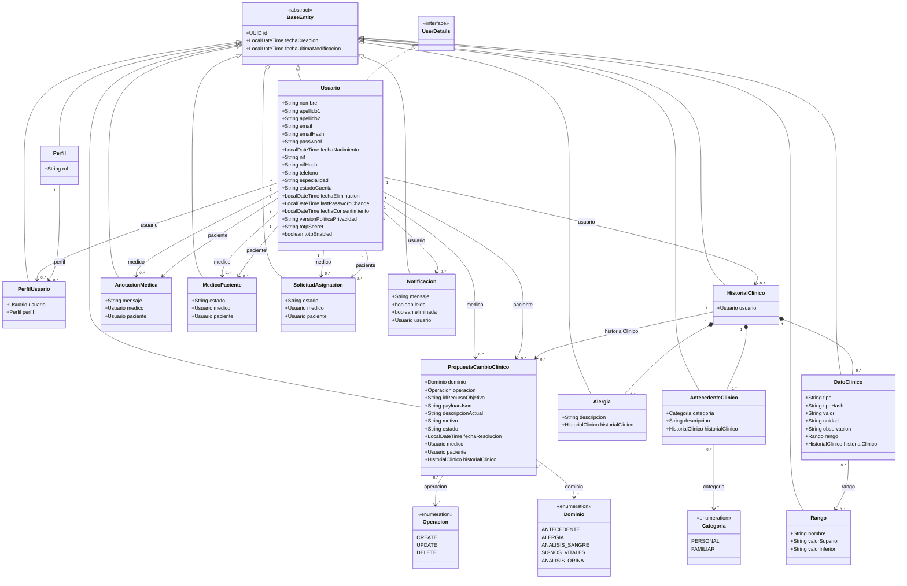
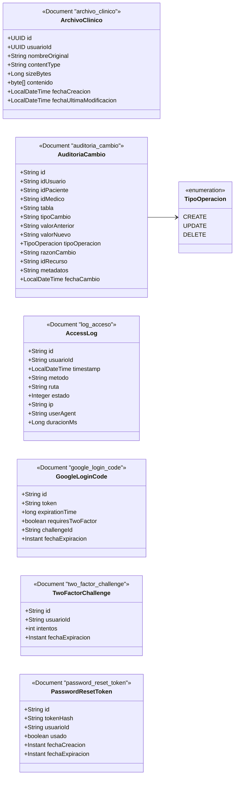
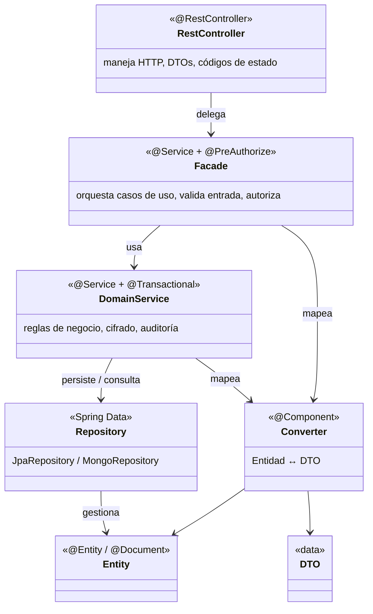
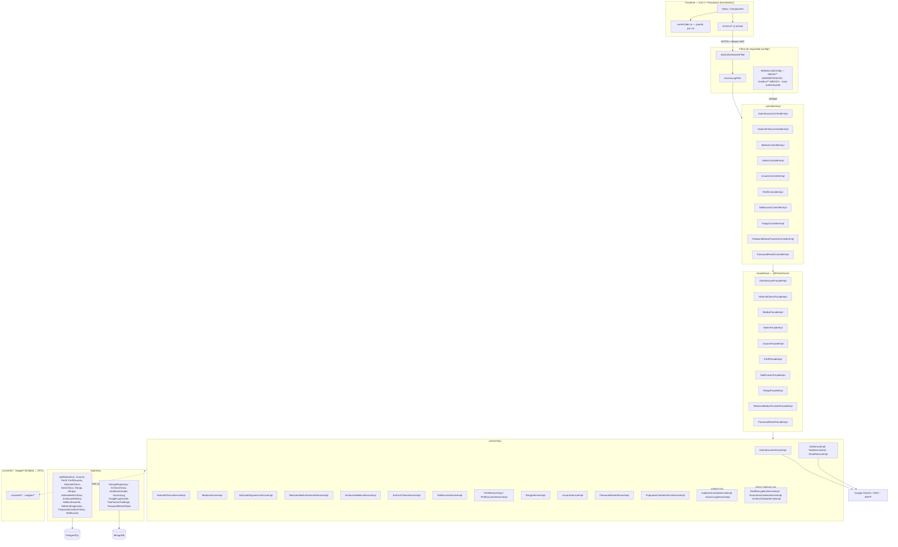
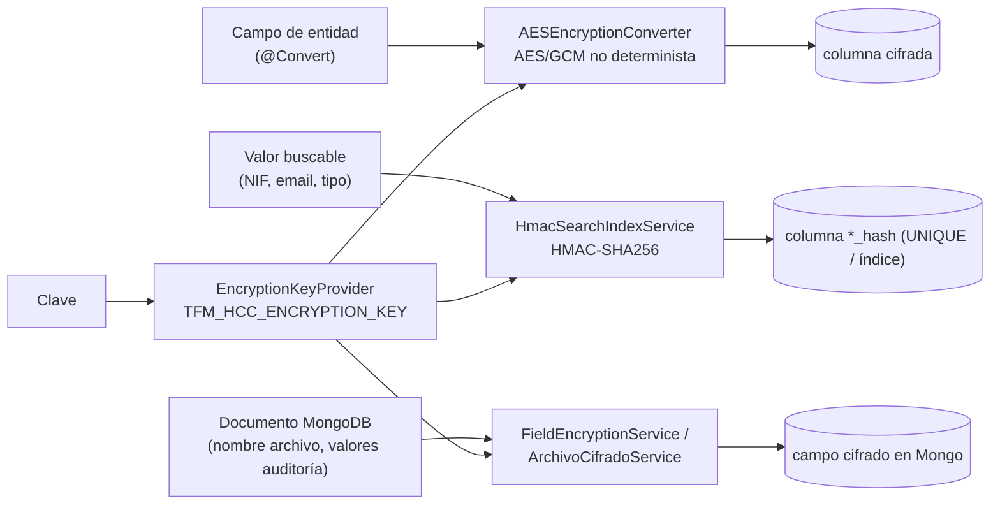

# Diagramas del sistema HCC (Historial Clínico Compartido)

Diagramas generados a partir de una revisión del código fuente (rama `dev/version/0.0.3`).
Reflejan el estado real de la aplicación: entidades JPA en `src/main/java/com/hcc/tfm_hcc/model`,
documentos MongoDB del mismo paquete, repositorios Spring Data y la arquitectura en capas
Controller → Facade → Service → Repository.

Notas transversales:

- Todas las entidades relacionales heredan de `BaseEntity`: `id` (UUID, PK, generado por la
  aplicación con `GenerationType.UUID`), `fecha_creacion` y `fecha_ultima_modificacion`.
- Varios atributos se persisten **cifrados con AES/GCM** (`AESEncryptionConverter` en JPA;
  `FieldEncryptionService` / `ArchivoCifradoService` en MongoDB). El cifrado es *no determinista*,
  por lo que las búsquedas por igualdad se hacen contra columnas `*_hash` (**HMAC-SHA256**,
  `HmacSearchIndexService`), no contra el valor cifrado. La relación completa de atributos
  cifrados está en la tabla «Atributos cifrados en reposo» de la sección 2.
- El registro del consentimiento (`fecha_consentimiento`, `version_politica_privacidad`) **no**
  es un dato de salud y se guarda sin cifrar (RGPD art. 7.1: poder demostrar qué se consintió).
- No existen claves ajenas entre PostgreSQL y MongoDB: la relación de los documentos con
  `usuario` es una **referencia lógica** por UUID (línea discontinua en el diagrama E-R).
- Persistencia políglota: datos clínicos y de identidad en **PostgreSQL**; auditoría, logs de
  acceso, archivos clínicos y tokens efímeros (2FA, Google, reset de contraseña) en **MongoDB**.

---

## 1. Diagrama Entidad-Relación

```mermaid
erDiagram
    %% ========== PostgreSQL (relacional, claves ajenas reales) ==========
    USUARIO {
        UUID id PK
        string nombre
        string apellido1
        string apellido2
        string email
        string email_hash UK
        string password
        datetime fecha_nacimiento
        string nif
        string nif_hash UK
        string telefono
        string especialidad
        string estado_cuenta
        datetime fecha_eliminacion
        datetime last_password_change
        datetime fecha_consentimiento
        string version_politica_privacidad
        string totp_secret
        boolean totp_enabled
    }
    PERFIL {
        UUID id PK
        string rol UK
    }
    PERFIL_USUARIO {
        UUID id PK
        UUID id_usuario FK
        UUID id_perfil FK
    }
    HISTORIAL_CLINICO {
        UUID id PK
        UUID id_paciente FK
    }
    DATO_CLINICO {
        UUID id PK
        string tipo
        string tipo_hash
        string valor
        string unidad
        string observacion
        UUID id_rango FK
        UUID id_historial_clinico FK
        datetime fecha_creacion
    }
    RANGO {
        UUID id PK
        string nombre UK
        string valor_superior
        string valor_inferior
    }
    ALERGIA {
        UUID id PK
        string descripcion
        UUID id_historial_clinico FK
    }
    ANTECEDENTE_CLINICO {
        UUID id PK
        string categoria
        string descripcion
        UUID id_historial_clinico FK
    }
    ANOTACION_MEDICA {
        UUID id PK
        UUID id_profesional FK
        UUID id_paciente FK
        string mensaje
    }
    MEDICO_PACIENTE {
        UUID id PK
        UUID id_medico FK
        UUID id_paciente FK
        string estado
    }
    SOLICITUD_ASIGNACION {
        UUID id PK
        UUID id_medico FK
        UUID id_paciente FK
        string estado
    }
    PROPUESTA_CAMBIO_CLINICO {
        UUID id PK
        UUID id_medico FK
        UUID id_paciente FK
        UUID id_historial_clinico FK
        string dominio
        string operacion
        string id_recurso_objetivo
        string payload_json
        string descripcion_actual
        string motivo
        string estado
        datetime fecha_resolucion
    }
    NOTIFICACION {
        UUID id PK
        UUID id_usuario FK
        string mensaje
        boolean leida
        boolean eliminada
    }

    %% ========== MongoDB (documentos, sin FK; referencia logica por UUID) ==========
    ARCHIVO_CLINICO {
        UUID id PK
        UUID id_usuario
        string nombre_original
        string content_type
        long size_bytes
        bytes contenido
        datetime fecha_creacion
    }
    AUDITORIA_CAMBIO {
        string id PK
        string id_usuario
        string id_paciente
        string id_medico
        string tabla
        string tipo_cambio
        string valor_anterior
        string valor_nuevo
        string tipo_operacion
        string razon_cambio
        string id_recurso
        string metadatos
        datetime fecha_cambio
    }
    LOG_ACCESO {
        string id PK
        string id_usuario
        datetime timestamp
        string metodo
        string ruta
        int estado
        string ip
        string user_agent
        long duracion_ms
    }
    PASSWORD_RESET_TOKEN {
        string id PK
        string token_hash UK
        string usuario_id
        boolean usado
        instant fecha_creacion
        instant fecha_expiracion
    }
    TWO_FACTOR_CHALLENGE {
        string id PK
        string usuario_id
        int intentos
        instant fecha_expiracion
    }
    GOOGLE_LOGIN_CODE {
        string id PK
        string token
        string challenge_id
        boolean requires_two_factor
        long expiration_time
        instant fecha_expiracion
    }

    USUARIO ||--o{ PERFIL_USUARIO : tiene
    PERFIL  ||--o{ PERFIL_USUARIO : "asignado en"
    USUARIO ||--o| HISTORIAL_CLINICO : posee
    HISTORIAL_CLINICO ||--o{ DATO_CLINICO : contiene
    HISTORIAL_CLINICO ||--o{ ALERGIA : contiene
    HISTORIAL_CLINICO ||--o{ ANTECEDENTE_CLINICO : contiene
    RANGO ||--o{ DATO_CLINICO : "sirve de referencia a"
    USUARIO ||--o{ ANOTACION_MEDICA : "escribe (medico)"
    USUARIO ||--o{ ANOTACION_MEDICA : "es sujeto de (paciente)"
    USUARIO ||--o{ MEDICO_PACIENTE : "como medico"
    USUARIO ||--o{ MEDICO_PACIENTE : "como paciente"
    USUARIO ||--o{ SOLICITUD_ASIGNACION : "como medico"
    USUARIO ||--o{ SOLICITUD_ASIGNACION : "como paciente"
    USUARIO ||--o{ PROPUESTA_CAMBIO_CLINICO : "como medico"
    USUARIO ||--o{ PROPUESTA_CAMBIO_CLINICO : "como paciente"
    HISTORIAL_CLINICO ||--o{ PROPUESTA_CAMBIO_CLINICO : "afecta a"
    USUARIO ||--o{ NOTIFICACION : "recibe"

    USUARIO ||..o{ ARCHIVO_CLINICO : "propietario"
    USUARIO ||..o{ AUDITORIA_CAMBIO : "referida por"
    USUARIO ||..o{ LOG_ACCESO : "referida por"
    USUARIO ||..o{ PASSWORD_RESET_TOKEN : "referida por"
    USUARIO ||..o{ TWO_FACTOR_CHALLENGE : "referida por"
```

### Estados y enumeraciones

| Columna | Valores |
|---|---|
| `USUARIO.estado_cuenta` | `ACTIVO` · `SUSPENDIDO` (limitación del tratamiento, art. 18 RGPD) · `ELIMINADO` (borrado lógico) |
| `PERFIL.rol` | `PACIENTE` · `MEDICO` · `ADMINISTRADOR` |
| `ANTECEDENTE_CLINICO.categoria` | `PERSONAL` · `FAMILIAR` |
| `MEDICO_PACIENTE.estado` | `ACTIVA` · `REVOCADA` |
| `SOLICITUD_ASIGNACION.estado` | `PENDIENTE` · `ACEPTADA` · `RECHAZADA` · `REVOCADA` |
| `PROPUESTA_CAMBIO_CLINICO.estado` | `PENDIENTE` · `ACEPTADA` · `RECHAZADA` · `ANULADA` |
| `PROPUESTA_CAMBIO_CLINICO.dominio` | `ANTECEDENTE` · `ALERGIA` · `ANALISIS_SANGRE` · `SIGNOS_VITALES` · `ANALISIS_ORINA` |
| `PROPUESTA_CAMBIO_CLINICO.operacion` / `AUDITORIA_CAMBIO.tipo_operacion` | `CREATE` · `UPDATE` · `DELETE` |

Notas: `email_hash`, `nif_hash` y `tipo_hash` son índices de búsqueda HMAC-SHA256; `password` es un
hash BCrypt y `token_hash` un SHA-256. Los campos `fecha_expiracion` de los documentos MongoDB
llevan índice TTL. `AUDITORIA_CAMBIO.id_medico` solo se rellena cuando el cambio lo origina un
médico mediante una propuesta aceptada. En `DATO_CLINICO`, `fecha_creacion` es la fecha real del
dato clínico, no la de inserción.

### Aclaraciones de cardinalidad

| Relación | Cardinalidad | Implementación |
|---|---|---|
| `usuario` – `perfil` | N:M | Tabla puente `perfil_usuario` (`@ManyToOne` a ambos lados) |
| `usuario` – `historial_clinico` | 1:0..1 | `@ManyToOne` sobre `id_paciente`; la unicidad la garantiza la capa de servicio, no un índice único |
| `historial_clinico` – `dato_clinico` / `alergia` / `antecedente_clinico` | 1:N (composición) | `@ManyToOne` con `id_historial_clinico NOT NULL` |
| `rango` – `dato_clinico` | 0..1:N | `id_rango` nullable; se asigna por coincidencia de nombre (ignorando mayúsculas/tildes) |
| `usuario` – `medico_paciente` / `solicitud_asignacion` | 1:N (doble rol) | N:M lógico médico↔paciente materializado con estado |
| `usuario` – `propuesta_cambio_clinico` | 1:N (doble rol) | El médico crea la propuesta; el paciente la confirma o rechaza |
| `historial_clinico` – `propuesta_cambio_clinico` | 1:N | Historial sobre el que se aplicaría el cambio al aceptarse |
| `usuario` – `anotacion_medica` | 1:N (doble rol) | `id_profesional` + `id_paciente` |
| `usuario` – documentos MongoDB | 1:N lógica | Referencia por UUID; sin integridad referencial entre motores |

---

## 2. Diagrama de clases UML — modelo de dominio

Diagrama de entidades del modelo de dominio (entidades JPA de `model/`). Herencia con triángulo
hueco desde `BaseEntity`, realización de interfaz con línea discontinua, composición (rombo
relleno) para el agregado `HistorialClinico` y multiplicidades en los extremos de cada asociación.
Cada relación `@ManyToOne` se muestra **también como atributo tipado** dentro de la clase (el
campo real de la entidad), con el mismo nombre que rotula la asociación. Se omiten los métodos;
los identificadores y las marcas de tiempo se heredan de `BaseEntity`.

### Atributos cifrados en reposo (AES/GCM)

| Clase | Atributos |
|---|---|
| `Usuario` | `nombre`, `apellido1`, `apellido2`, `email`, `nif`, `telefono`, `fechaNacimiento`, `totpSecret` |
| `DatoClinico` | `tipo`, `valor`, `unidad`, `observacion` |
| `Alergia` | `descripcion` |
| `AntecedenteClinico` | `descripcion` |
| `AnotacionMedica` | `mensaje` |
| `PropuestaCambioClinico` | `payloadJson`, `descripcionActual`, `motivo` |
| `AuditoriaCambio` (Mongo) | `valorAnterior`, `valorNuevo` |
| `ArchivoClinico` (Mongo) | `nombreOriginal`, `contenido` |

Índices de búsqueda deterministas (HMAC-SHA256): `Usuario.emailHash` (UNIQUE), `Usuario.nifHash`
(UNIQUE), `DatoClinico.tipoHash`. Contraseña: solo hash BCrypt. `PasswordResetToken.tokenHash`:
SHA-256.

### Documentos MongoDB (fuera de la jerarquía `BaseEntity`)

`AuditoriaCambio.idMedico` se rellena cuando el cambio lo origina un médico a través de una
`PropuestaCambioClinico` aceptada por el paciente; en los cambios que hace el paciente sobre su
propio historial es nulo.

---

## 3. Diagrama de clases UML — arquitectura en capas

Patrón por *vertical slice*: cada área funcional (autenticación, historial, médico, admin,
perfil, notificaciones, rangos, relaciones, propuestas de cambio, reset de contraseña) repite la
misma pila. Interfaz + implementación en cada capa. La autorización declarativa (`@PreAuthorize`)
vive en la **fachada**.

### Componentes reales por capa

### Capa transversal de protección de datos (RGPD / LOPDGDD)

---

## 4. Casos de uso y roles (contexto)

| Rol | Vías de acceso | Capacidades principales |
|---|---|---|
| **PACIENTE** | NIF + contraseña (+ TOTP opcional), Google OAuth2 | Consentimiento explícito al registrarse (art. 9.2.a RGPD); ver y editar su historial (antecedentes, alergias, análisis de sangre/orina, signos vitales), incluida la edición individual de un dato; confirmar o rechazar los cambios propuestos por un médico; subir archivos clínicos; aceptar/rechazar solicitudes de médicos y revocarlos; ver logs de acceso; exportar sus datos; limitar/reanudar el tratamiento (art. 18 RGPD); borrado lógico de cuenta |
| **MEDICO** | NIF + contraseña (+ TOTP) | Buscar pacientes, enviar solicitudes de asignación, consultar el historial de pacientes asignados (`estado = ACTIVA` y cuenta no `SUSPENDIDO`), crear anotaciones médicas, ver/subir archivos del paciente, **proponer** altas/correcciones/borrados sobre el historial (con motivo obligatorio; solo se aplican tras la confirmación del paciente) |
| **ADMINISTRADOR** | NIF + contraseña (+ TOTP) | Alta/baja de médicos, otorgar/retirar el perfil médico, buscar usuarios por NIF. Sin acceso a datos clínicos |

Autenticación: JWT sin estado (`Authorization: Bearer`, 1 hora), invalidado por `lastPasswordChange`.
Segundo factor TOTP (RFC 6238) opcional, con un máximo de 5 intentos por reto. Login con Google
mediante código de un solo uso persistido en MongoDB con TTL.

---

_Para regenerar: revisar `model/`, `repository/`, `controller/impl/`, `facade/impl/`,
`service/impl/` y `config/WebSecurityConfig.java`._
